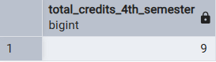
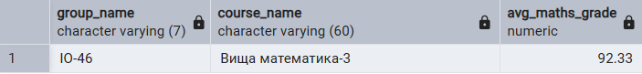
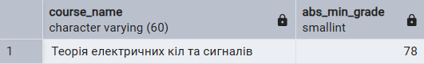
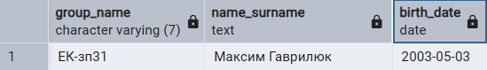
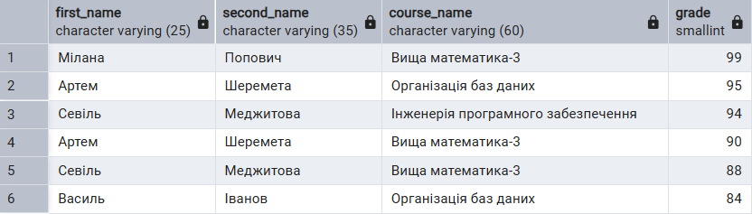
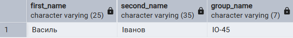
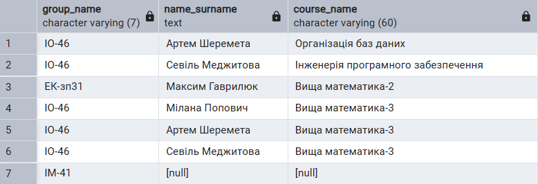
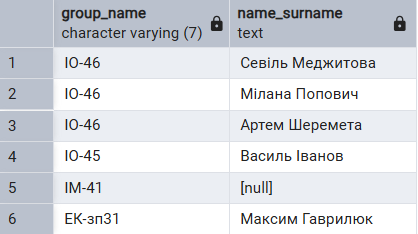
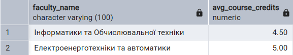
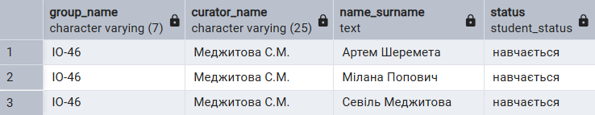

# Лабораторна робота № 4
# ІО-46 Попович Мілана, Шеремета Артем
## Тема: Аналітичні SQL-запити (OLAP)
---
## Цілі
- Використати агрегатні функції, такі як `COUNT`, `SUM`, `AVG`, `MIN` та `MAX`, для обчислення зведеної статистики з наших даних.
- Написати запити `GROUP BY` для групування рядків за одним або кількома стовпцями та обчислення агрегатів для кожної групи.
- Використати `HAVING` для фільтрації результатів згрупованих запитів на основі агрегованих умов.
- Виконати операції `JOIN` (принаймні `INNER JOIN` та `LEFT JOIN`), щоб об'єднати дані з кількох таблиць.
- Створити об'єднані запити на агрегацію для кількох таблиць, які об'єднують таблиці та створюють згрупований, агрегований вивід.
- Інтерпретувати результати запитів та пояснити, що робить кожен з них.
---
## Результати
1. Запити з агрегаційними функціями (`SUM`, `AVG`, `COUNT`, `MIN`, `MAX`, `GROUP BY`) 
```sql
-- SUM: вивести загальну к-сть кредитів дисциплін 4 семестру
select sum(credits) as total_credits_4th_semester
from course
where student_year = 2 and is_active = true;
```
Результат: 



```sql
-- AVG: в групі ІО-46 вивести середній бал з предмету Вища математика-3
select g.group_name, c.course_name, 
	round(avg(e.grade), 2) as avg_maths_grade
from enrollment e
join student s on e.student_id = s.student_id
join student_group g on s.group_id = g.group_id
join course c on e.course_id = c.course_id
where g.group_name = 'IO-46' and c.course_name = 'Вища математика-3'
group by g.group_name, c.course_name;
```
Результат:



```sql
-- MIN: Вивести найнижчий бал з потоку ІО-4х та назву дисципліни
select 
	c.course_name, 
	e.grade as abs_min_grade
from enrollment e 
join course c on e.course_id = c.course_id
join student s on e.student_id = s.student_id
join student_group g on s.group_id = g.group_id 
where g.group_name like 'ІО-4%' and e.grade = (
	select min(e.grade)
	from enrollment e
	join student s on e.student_id = s.student_id
	join student_group g on s.group_id = g.group_id
	where g.group_name like 'ІО-4%'
);
```
Результат:



```sql
-- MAX: вивести інформацію про найстаршого студента 
select
	g.group_name,
	s.first_name || ' ' || s.second_name as name_surname,
	s.birth_date
from student s
join student_group g on s.group_id = g.group_id
where (current_date - s.birth_date) = (
	select max(current_date - birth_date)
	from student
);
```
Результат:



---

2. Запити з операціями об'єднання таблиць (`INNER JOIN`, `LEFT JOIN`, `RIGHT JOIN`, `FULL JOIN`, `CROSS JOIN`)

```sql
-- INNER JOIN: вивести імена, прізвища та оцінки студентів з курсів, де бал більше 80, в порядку спадання
select 
    s.first_name, 
    s.second_name, 
    c.course_name, 
    e.grade
from enrollment e
join student s on e.student_id = s.student_id
join course c on e.course_id = c.course_id
where e.grade > 80
order by e.grade desc;
```
Результат:



```sql
-- LEFT JOIN: вивести імена, прізвища та групи студентів, у яких немає жодних оцінок
select s.first_name, s.second_name, g.group_name
from student s 
join student_group g on s.group_id = g.group_id
left join enrollment e on s.student_id = e.student_id
where e.student_id is null;
```

Результат:



```sql
-- FULL JOIN: вивести список усіх активних студентів та курсів, на які вони записані
select 
	g.group_name,
	s.first_name || ' ' || s.second_name as name_surname,
	c.course_name
from student s
full join enrollment e on s.student_id = e.student_id
full join student_group g on s.group_id = g.group_id
full join course c on e.course_id = c.course_id
where s.status = 'навчається' or s.student_id is null or c.course_id is null;
```
Результат:



```sql
-- RIGHT JOIN: вивести усі групи, в тому числі ті, що без студентів
select g.group_name, s.first_name || ' ' || s.second_name as name_surname
from student s
right join student_group g ON s.group_id = g.group_id;
```
Результат:



---

3. Запити з використанням підзапитів (вибірка з підзапитом в `SELECT`, `WHERE`, `HAVING`)

```sql
-- Знайти групу з найвищим середнім балом з усіх предметів
select g.group_name, round(avg(e.grade), 2) as avg_group_grade
from enrollment e 
join student s on e.student_id = s.student_id
join student_group g on s.group_id = g.group_id
group by g.group_id, g.group_name
having avg(e.grade) > (select avg(grade) from enrollment);
```

Результат:



```sql
-- Знайти факультети, де середня к-сть кредитів на один курс вища за середню
select f.faculty_name, round(avg(c.credits), 2) as avg_course_credits
from course c 
join faculty f on c.faculty_id = f.faculty_id
group by f.faculty_id, f.faculty_name
having avg(c.credits) > (select avg(credits) from course);
```

Результат:


```sql
-- Знайти та вивести інформацію про групу, в якій навчається студент Шеремета Артем
select
    g.group_name,
    g.curator_name,
    s.first_name || ' ' || s.second_name as name_surname,
    s.status
from student s
join student_group g on s.group_id = g.group_id
where s.group_id = (select s.group_id from student s
	where s.first_name = 'Артем' and s.second_name = 'Шеремета'
);
```
Результат:



---
## Висновки
